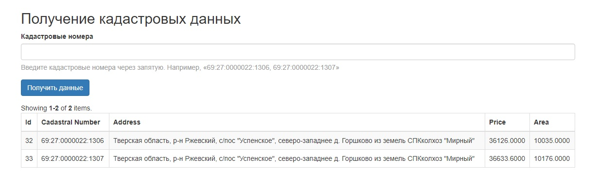

● Развертывание приложения

git clone https://github.com/TerMihSer/CadastralNumbers  
composer install  
Создаем базу данных:  
create or replace schema bigland_test collate utf8mb4_bin;  
Создаем базу данных для тестов:  
create or replace schema yii2advanced_test collate utf8mb4_bin;  
Выполняем миграции:  
yii migrate  
Настраиваем common/config/main-local.php подключение к базе данных.

● Использование компонента  
common/components/CadastralNumbers  
Алгоритм работы:  
Метод getData() получает один или несколько кадастровых
номеров и получает данные с сервера по API.
Перед запросом к API, компонент проверяет, есть ли данные по кадастровому
номеру в базе данных.
* Если есть 
    * Вернуть модель.
* Если данных в базе нет
    * Получить данные через API
    * Сохранить их в базу данных
    * Вернуть модель.

Для запуска консольного приложения:  
yii parser/parse 69:27:0000022:1306  
Для запуска rest:  
Использовал phpstorm REST Client в path GET "/api/v1/plots/{id}"  
Для запуска теста парсера:  
vendor\bin\codecept run -- -c common

● Скриншоты результата работы приложения

